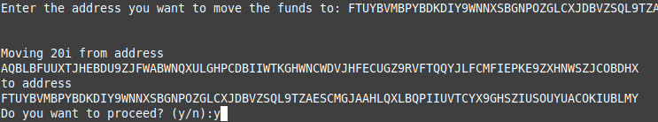
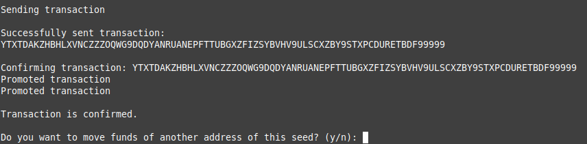
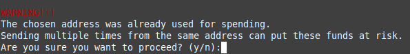

# iotaBalanceMover


## What is it for?
While the Iota Trinity wallet is easy to use it does not allow to specify which address you want to send from.
The iotaBalanceMover lists all addresses of your seed and allows selecting a specific one to use as input for a transaction.


## How to use the tool
Once the program is running you will have to enter the seed. The seed is required to generate the addresses and to sign the moving transaction.


##### Balance
With the given seed the programm calculates a number of addresses and sums up the found balance. If the balance is not correct another batch of addresses will be generated until your full balance is detected.


##### Address Index
The program then prints out a list of all addresses with a positive balances and lets you choose which address you want use as an input for your transaction. 


##### Target Address
After entering the target address you will get a summary of what the transaction will look like.


##### Sending Transcation
If everything is displayed as you expect the transaction will be sent to the tangle. The transaction hash of the new transaction will be reported.


It is possible to perform further transactions after that.


## Disclaimer
NEVER share your seed with anyone. No community member or member of the Iota Foundation will ever ask for your seed. If someone does it is 100% a scam to steal your money. That said, even entering your seed into a software other than the official Iota wallet should not be handled lightly and can only be recommended as a last resort.
Unlike Trinity this program does not block funds on spent addresses, but will rather let you transfer them. Only do this if you are aware of the invlved risks.



## How to start the tool
The simplest way is to download the appropriate binary executable for your operating system from [releases](https://github.com/HBMY289/iotaBalanceMover/releases). You can also build the tool from source, which is rather easy as well. Assuming you have [go](https://golang.org/doc/install) and [git](https://www.atlassian.com/git/tutorials/install-git) installed already you can just execute this command for example in your user folder to get a copy of the source code.
```
git clone https://github.com/HBMY289/iotaBalanceMover.git
```

Then you change into the new folder and build the excutable.
```
cd iotaBalanceMover
go build
```
After that you can just start the newly created binary file by typing
```
./iotaBalanceMover
```
or on Windows
```
iotaBalanceMover.exe
```

## Need additonal help?
If you need any additonal help either with the tool you can contact me (HBMY289) in the #help channel of the official [Iota Discord server](https://discord.iota.org/).

